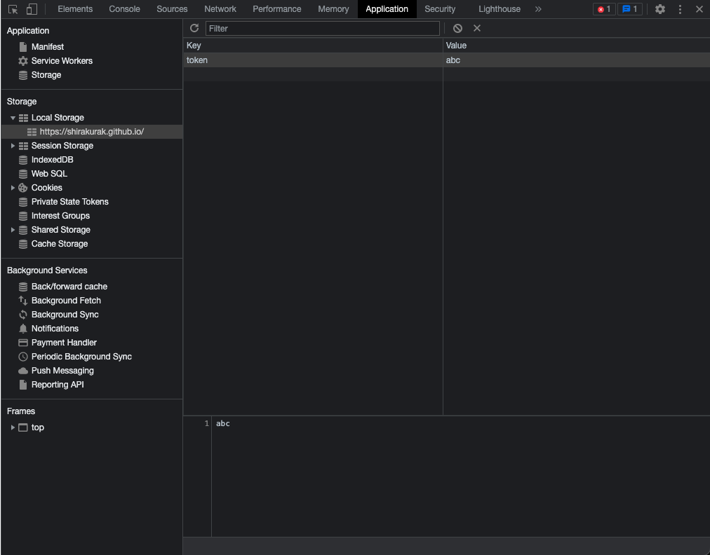

# TinyLocalStorageViewer

A command-line tool to retrieve the value corresponding to  a specific key in LocalStrage.



## Usage

Change parameters in `config.js` and

```sh
cd TinyLocalStorageViewer
node index.js
```

## Requirements

- node v14.18.1
- puppeteer@20.2.1

## License

[MIT](https://en.wikipedia.org/wiki/MIT_License).
